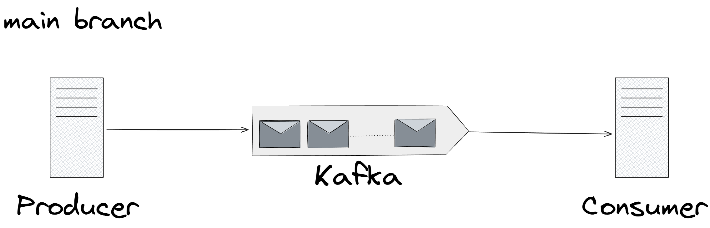

Spring Kafka의 직렬화/역직렬화 오류를 해결하기 위해 실험한 브랜치입니다.

---

## 구성


   
생산자 - 카프카 - 소비자가 연결되어 있습니다.

### 속성

최종적으로 동작하는 application.yml 파일 내용입니다.

1. 생산자

  ```yaml
  spring:
    application:
      name: kafka_producer

    kafka:
      bootstrap-servers: localhost:9092
      producer:
        key-serializer: org.apache.kafka.common.serialization.StringSerializer
        value-serializer: org.springframework.kafka.support.serializer.JsonSerializer
        properties:
          spring.json.add.type.headers: false
  ```

2. 소비자

  ```yaml
  spring:
    application:
      name: kafka_consumer

    kafka:
      bootstrap-servers: localhost:9092
      consumer:
        group-id: my-group
        auto-offset-reset: earliest
        key-deserializer: org.apache.kafka.common.serialization.StringDeserializer
        value-deserializer: org.springframework.kafka.support.serializer.JsonDeserializer
        properties:
          spring.json.trusted.packages: "*"
          spring.json.value.default.type: hello.kafka.MyMessage
  ```

### 생산자의 메시지 클래스

생산자의 메시지 클래스는 다음과 같습니다. `__TypeId__` 오류를 재현하기 위해 일부러 생산자에서는 메시지 클래스를 dto 패키지 하위에 두었습니다.

```java
package hello.kafka.dto;

import java.time.LocalDateTime;
import lombok.AllArgsConstructor;
import lombok.Getter;

@Getter
@AllArgsConstructor
public class MyMessage {
    private String message;
    private LocalDateTime createdAt;
}
```

---

## 실행 방법

최상위 경로에서 카프카를 실행하기 위해 도커를 사용합니다.

```bash
docker compose up
```

카프카는 localhost:9092로 접근할 수 있으며, 기본으로 `my-topic` 토픽이 생성됩니다.

생산자를 실행한 뒤 다음 curl로 메시지를 전송할 수 있습니다.

```bash
curl http://localhost:8080/send?message=hello
```

정상 처리 시 "ok"가 반환됩니다.